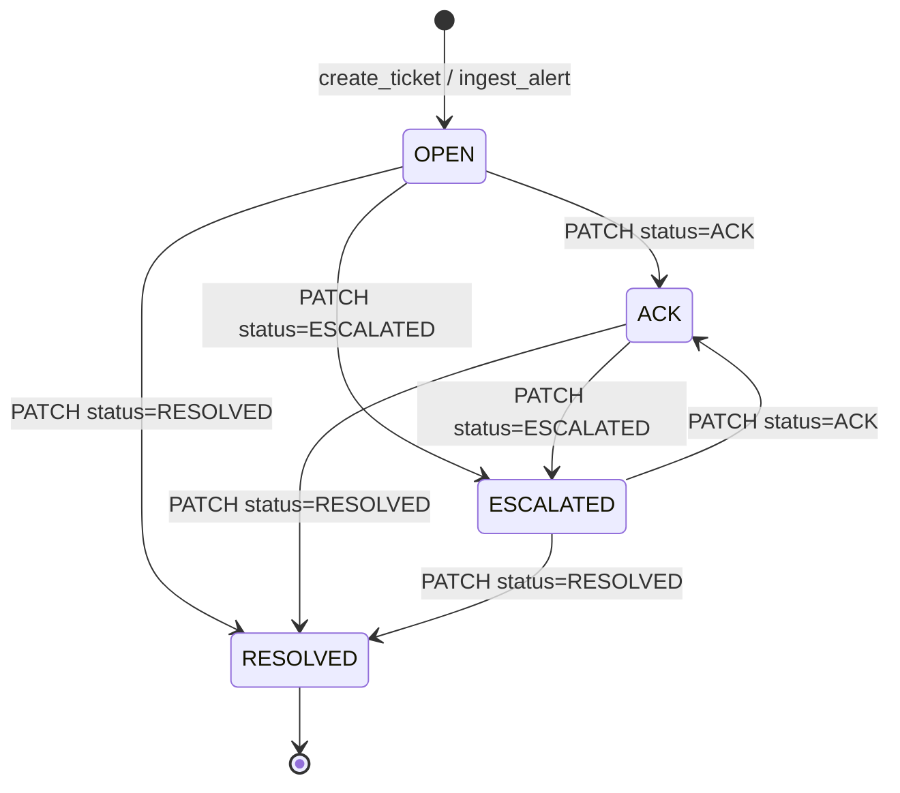
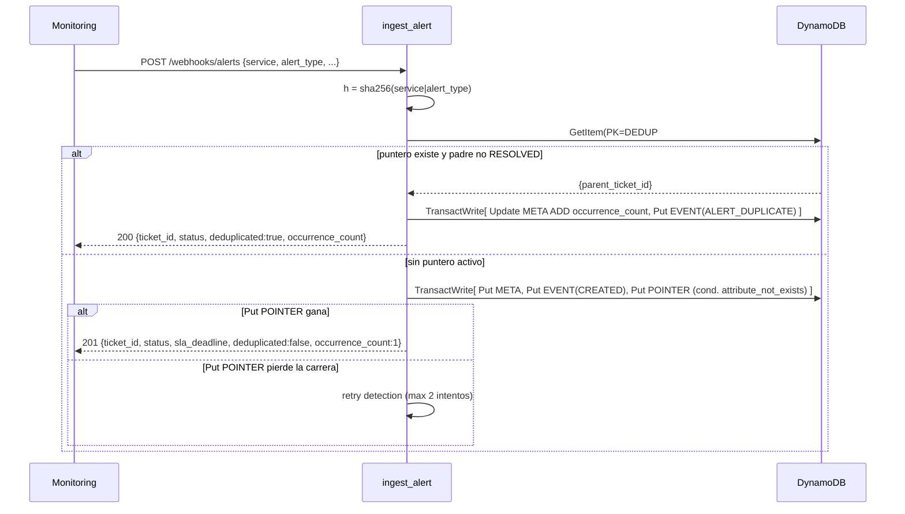

# TicketResolve — Aplicación (backend) · Decisiones y Contrato

Este documento es la **especificación de implementación** del código de la app que vive en `Dev/`.
Lo escribe el rol de arquitectura (decisiones); el código que de aquí se deriva no requiere decisiones
nuevas — solo seguir este contrato. Insumo de diseño: [`cloud/entrega-2-diseno-aplicacion.md`](../cloud/entrega-2-diseno-aplicacion.md)
y [`cloud/Entrega-3-Red.md`](../cloud/Entrega-3-Red.md) §9, §10.

> **Estado actual del slice:** `api-tickets` cubre **US-01 crear, US-02 webhook+dedup,
> US-03 dashboard, US-05 reconocer/escalar/resolver (máquina de estados + comentarios),
> US-06 reasignar**, más adjuntos con subida y descarga (F-04/F-05). Consolidado a calidad
> de producción para el alcance académico (ver §9).
> **Modo de prueba:** local primero (moto / DynamoDB Local), **160 tests backend**.
> **Frontend:** ya existe (React + Vite, pantallas M1/M2/M3) — documentado en [FRONTEND.md](FRONTEND.md);
> este documento cubre el **contrato y las decisiones del backend**.

---

## Qué cambió (2026-06-10)

Respecto a la versión previa de este documento (slice limitado a US-01/US-03/US-05 "solo
RESOLVED"), el backend incorporó:

- **Webhook de alertas + deduplicación (US-02):** nueva ruta `POST /api/v1/webhooks/alerts`
  (`ingest_alert`). Dedup determinista por `dedup_hash = sha256(service|alert_type)` normalizado,
  con un **puntero race-free** (`PK=DEDUP#<hash>, SK=ACTIVE`) — ver §4.7 y §6.
- **Máquina de estados completa (US-04/US-05):** `PATCH /api/v1/incidents/{id}` ya no solo
  resuelve; transiciona `OPEN/ACK/ESCALATED/RESOLVED` según `models.ALLOWED_TRANSITIONS`, con
  optimistic locking (`version`) y eventos de auditoría por transición — ver §4.3 y §6.
- **Dashboard "todos los pendientes" (cambio de contrato no disruptivo):** `GET
  /api/v1/incidents` con `assignee` **vacío o ausente** ahora devuelve **todos** los tickets en
  el estado solicitado (Scan paginado), no solo los del ingeniero — ver §5 (PA-2).
- **Reasignación de ticket (US-06):** nueva ruta `PATCH /api/v1/incidents/{id}/assignee`
  (`reassign_ticket`), con optimistic locking y evento `ASSIGNED` — ver §6.
- **Descarga de adjuntos:** `get_ticket` ahora devuelve `download_url` (presigned GET, 5 min)
  por cada adjunto, y **deja de exponer `s3_key`** — ver §4.8 y §6.
- **Endurecimiento adicional (sin cambiar contratos previos):** Scan del dashboard global
  paginado con topes de seguridad; puntero determinista de dedup (cierra una condición de
  carrera del enfoque "solo GSI"); `dedup_hash` excluido de las respuestas de `get_ticket`;
  sanitización de `source` en el webhook (`_SOURCE_SAFE_RE`).
- **Dev server:** ahora siembra **7 tickets de demostración** al arrancar (`SEED_DEMO`,
  default `1`) cubriendo los flujos nuevos (ACK/ESCALATED, dedup con `occurrence_count`,
  reasignación, ticket RESOLVED).

Estos cambios **no rompen** el contrato previo de `create_ticket`/`add_comment`/`get_ticket`
(salvo la adición de `download_url`/eliminación de `s3_key` en adjuntos, y los nuevos campos
opcionales de META descritos en §3).

---

## 1. Qué encaja con la infra ya desplegada (no se cambia infra en este paso)

| Recurso vivo | Valor fijado por Terraform | Implicación para el código |
|---|---|---|
| Runtime Lambda | `python3.12` | Código Python 3.12, solo stdlib + `boto3` (incluido en el runtime). |
| Handler | `lambda_function.lambda_handler` | El archivo de entrada **debe** llamarse `lambda_function.py` y exponer `lambda_handler(event, context)`. |
| Tabla DynamoDB | `ticketresolve-dev` (env `TABLE_NAME`) | Nombre se lee de `os.environ["TABLE_NAME"]`. Single-table. |
| GSI1 | `ASSIGN#<eng>` / `STATUS#<s>#SLA#<t>` | Dashboard por ingeniero (PA-2) y, con `assignee` vacío, base del Scan global filtrado por `status`. |
| GSI2 | `HASH#<h>` / `TICKET#<parentId>` | Índice histórico hash→ticket (US-02); no es la ruta autoritativa de dedup en caliente (ver §4.7, puntero `DEDUP#<hash>`). |
| Bucket adjuntos | env `ATTACHMENTS_BUCKET` | Presigned PUT (subida, 15 min) y presigned GET (descarga, 5 min) para adjuntos. |
| API Gateway | rutas crafteadas localmente (dev server) | Las 7 rutas de §6 ya están implementadas en `lambda_function.py`; el wiring real en API Gateway sigue siendo trabajo de infra posterior (igual que en la versión previa de este documento). |

**Nombres de atributos de índice en la tabla** (deben coincidir con el módulo `database`): `PK`, `SK`,
`GSI1PK`, `GSI1SK`, `GSI2PK`, `GSI2SK`. *(El que implemente debe confirmar estos nombres en
`infra/modules/database/main.tf` antes de codificar las keys.)*

---

## 2. Layout del proyecto en `Dev/`

```
Dev/
  ARCHITECTURE.md          # este documento (NO tocar desde código)
  README.md                # cómo instalar y correr tests (lo escribe el dev)
  requirements.txt         # runtime: boto3 (pin para local; en Lambda ya viene)
  requirements-dev.txt     # pytest, moto[dynamodb,s3]
  src/
    shared/
      __init__.py
      keys.py              # builders de PK/SK/GSI — la fuente de verdad de la single-table
      ids.py               # generación de ticket_id y uuids cortos
      models.py            # severidad→SLA, estados, dataclasses/typed dicts
      ddb.py               # factory de recurso boto3 + helpers de tabla
      s3.py                # presigned URL helper
      http.py              # parseo de evento HTTP API v2 + respuestas JSON
    api_tickets/
      __init__.py
      lambda_function.py   # handler: router por método+path → service
      service.py           # lógica de negocio (create/list/get/comment/update_status/reassign/ingest_alert)
  tests/
    conftest.py              # fixtures moto: tabla con GSI1/GSI2 + bucket
    test_create_ticket.py
    test_get_ticket.py
    test_dashboard.py
    test_comment_resolve.py
    test_status_transitions.py  # máquina de estados (US-04/US-05): transiciones válidas/inválidas, 409
    test_reassign.py             # PATCH /assignee (US-06): reasignación, 409, guard RESOLVED
    test_webhook_ingesta.py       # POST /webhooks/alerts (US-02): dedup, puntero, occurrence_count
    test_attachment_download.py  # download_url en get_ticket, s3_key oculto
    test_handler_routing.py       # routing de las 7 rutas, orden de matching, errores 400/404/409/500
    test_shared.py                 # keys, ids, models, http (incl. dedup_hash, ALLOWED_TRANSITIONS)
```

> **Packaging (nota, no se hace ahora):** para desplegar, el zip de la Lambda debe contener
> `lambda_function.py` en la raíz **más** el paquete `shared/`. Hoy el módulo `compute` zipea un
> placeholder inline. Reestructurar el build de Terraform para tomar el código real es una tarea de
> entrega de IaC posterior; este paso es solo código + tests locales.

---

## 3. Modelo single-table — items que produce este slice

Todos los items de un ticket comparten `PK = TICKET#<ticket_id>`, salvo el **puntero de dedup**
(§4.7), que vive en su propia partición `PK = DEDUP#<hash>`.

| Item | PK | SK | GSI1PK | GSI1SK | GSI2PK | GSI2SK | Atributos |
|---|---|---|---|---|---|---|---|
| Ticket META | `TICKET#<id>` | `META` | `ASSIGN#<eng>` | `STATUS#<status>#SLA#<sla_iso>` | `HASH#<h>` *(solo si viene de webhook)* | `TICKET#<id>` *(ídem)* | `ticket_id, title, service, description, severity, status, assignee, sla_deadline, created_at, updated_at, version, attachments_count, occurrence_count, source, dedup_hash, resolved_at` |
| Evento auditoría | `TICKET#<id>` | `EVENT#<ts_iso>#<u8>` | — | — | — | — | `event_type, actor, action, payload, created_at` |
| Comentario | `TICKET#<id>` | `COMMENT#<ts_iso>#<u8>` | — | — | — | — | `author, body, created_at` |
| Adjunto (ref S3) | `TICKET#<id>` | `ATTACH#<uuid>` | — | — | — | — | `s3_key, filename, content_type, size` |
| Puntero de dedup | `DEDUP#<hash>` | `ACTIVE` | — | — | — | — | `parent_ticket_id` |

- `<u8>` = primeros 8 hex de un uuid4 (desempate dentro del mismo timestamp).
- Los ítems META llevan también `GSI1PK`/`GSI1SK`; los demás **no** se proyectan a GSI1 (no llevan
  esos atributos).
- `GSI2PK`/`GSI2SK` (`HASH#<h>` / `TICKET#<parentId>`) **solo** los llevan los META creados vía
  `ingest_alert` (US-02). Es un índice **histórico** hash→ticket; la detección de dedup en caliente
  no lo consulta (ver §4.7).
- `occurrence_count`, `source`, `dedup_hash` y `resolved_at` **solo** existen en META de tickets
  creados vía webhook (`occurrence_count`/`source`/`dedup_hash`) o que pasaron por `RESOLVED`
  (`resolved_at`). No están presentes en tickets creados manualmente vía `create_ticket` que
  nunca se resolvieron.
- `dedup_hash` **nunca se devuelve** al cliente: `get_ticket` lo excluye explícitamente
  (`_strip_ddb_keys`) — ver §4.8.
- El **puntero de dedup** (`DEDUP#<hash> / ACTIVE`) es el único item de la tabla cuyo `PK` no
  empieza con `TICKET#`. Es efímero: se crea junto con el primer ticket de un hash y se borra
  (idempotente) cuando ese ticket pasa a `RESOLVED`.

```mermaid
erDiagram
    TICKET_META {
        string PK "TICKET#<id>"
        string SK "META"
        string GSI1PK "ASSIGN#<assignee>"
        string GSI1SK "STATUS#<status>#SLA#<sla_iso>"
        string GSI2PK "HASH#<hash> (solo webhook)"
        string GSI2SK "TICKET#<id> (solo webhook)"
        string ticket_id
        string title
        string service
        string description
        string severity "P0|P1|P2"
        string status "OPEN|ACK|ESCALATED|RESOLVED"
        string assignee
        string sla_deadline "ISO-8601 UTC"
        string created_at
        string updated_at
        string resolved_at "solo si RESOLVED"
        int version "optimistic lock"
        int attachments_count
        int occurrence_count "solo webhook, default 1"
        string source "solo webhook, ej. 'prometheus'"
        string dedup_hash "solo webhook, NUNCA expuesto"
    }
    TICKET_EVENT {
        string PK "TICKET#<id>"
        string SK "EVENT#<ts_iso>#<u8>"
        string event_type "CREATED|ACK|ESCALATED|RESOLVED|COMMENT_ADDED|ALERT_DUPLICATE|ASSIGNED"
        string actor
        string action
        json payload
        string created_at
    }
    TICKET_COMMENT {
        string PK "TICKET#<id>"
        string SK "COMMENT#<ts_iso>#<u8>"
        string author
        string body
        string created_at
    }
    TICKET_ATTACHMENT {
        string PK "TICKET#<id>"
        string SK "ATTACH#<uuid>"
        string s3_key "interno, NUNCA expuesto"
        string filename
        string content_type
        int size
    }
    DEDUP_POINTER {
        string PK "DEDUP#<sha256(service|alert_type)>"
        string SK "ACTIVE"
        string parent_ticket_id
    }
    TICKET_META ||--o{ TICKET_EVENT : "tiene"
    TICKET_META ||--o{ TICKET_COMMENT : "tiene"
    TICKET_META ||--o{ TICKET_ATTACHMENT : "tiene"
    DEDUP_POINTER }o--|| TICKET_META : "apunta a (parent_ticket_id)"
```

---

## 4. Reglas de negocio (decisiones fijadas)

### 4.1 ticket_id
`ticket_id = "TKT-" + uuid4().hex[:8].upper()` → ej. `TKT-9F3A1C2D`. Único, legible, suficiente para
el alcance académico. No se usa contador secuencial (mal patrón en DynamoDB).

### 4.2 Severidad → SLA (minutos)
| Severidad | SLA |
|---|---|
| `P0` | 15 min |
| `P1` | 240 min (4 h) |
| `P2` | 1440 min (24 h) |

`sla_deadline = created_at + SLA`. Se guarda como **ISO-8601 UTC** (`2026-06-01T12:00:00Z`) para que el
orden lexicográfico del GSI1SK coincida con el orden cronológico.

### 4.3 Estados y máquina de transiciones (US-04/US-05)

`OPEN` es el estado inicial de todo ticket. A partir de ahí, `PATCH /api/v1/incidents/{id}`
transiciona el ticket según `models.ALLOWED_TRANSITIONS`:

| Estado origen | Destinos permitidos |
|---|---|
| `OPEN` | `ACK`, `ESCALATED`, `RESOLVED` |
| `ACK` | `ESCALATED`, `RESOLVED` |
| `ESCALATED` | `ACK`, `RESOLVED` |
| `RESOLVED` | *(ninguno — estado terminal)* |

`OPEN` **nunca** es un destino válido (un ticket no puede "des-reconocerse" de vuelta a `OPEN`).
`VALID_TARGET_STATUSES = {ACK, ESCALATED, RESOLVED}`.



**Contrato del PATCH** (`update_status`): body `{status, actor, version}`.

- **Optimistic locking:** `version` debe coincidir con el `version` actual de la META; si no,
  `409 VersionConflict`. La `ConditionExpression` valida **simultáneamente** `version` Y que el
  `status` actual sea un origen válido para el destino solicitado (cierra una ventana TOCTOU
  entre la lectura y la escritura).
- **Guardas de aplicación previas a la escritura:** `status` destino debe estar en
  `VALID_TARGET_STATUSES` (si no, `400`); `actor` requerido (≤ `MAX_ACTOR_LEN`); `version` entero
  ≥ 1; la transición `current_status → target_status` debe estar en `ALLOWED_TRANSITIONS` (si no,
  `400` con el detalle de los destinos permitidos).
- **Evento de auditoría por transición** (escrito atómicamente junto al `UpdateItem` vía
  `transact_write_items`):

  | Destino | `event_type` | `action` |
  |---|---|---|
  | `ACK` | `ACK` | `"Ticket reconocido"` |
  | `ESCALATED` | `ESCALATED` | `"Ticket escalado"` |
  | `RESOLVED` | `RESOLVED` | `"Ticket resuelto"` |

- **`resolve_ticket`** se mantiene como wrapper delgado de compatibilidad hacia atrás
  (`resolve_ticket(ticket_id, body) == update_status(ticket_id, body)`); el router llama
  directamente a `update_status`.

### 4.4 Severidad y asignación en creación
- La severidad llega en el payload; si falta, **default `P2`** (simplificación documentada: el cálculo
  automático por reglas se difiere; el portal humano la informa). Validar que sea P0/P1/P2.
- `assignee`: si falta, `UNASSIGNED`. GSI1PK = `ASSIGN#<assignee>` (incluido `ASSIGN#UNASSIGNED`).

### 4.5 Optimistic locking
Cada META lleva `version` (entero, inicia en 1). Toda transición de estado (§4.3), la
reasignación (§4.9) y el dedup (§4.7, vía `ADD occurrence_count`) usan **`transact_write_items`
con `ConditionExpression`** sobre `version` esperado e incrementan `version`. Conflicto → 409.

### 4.6 SLA congelado al resolver
Al pasar a `RESOLVED`: `status=RESOLVED`, `resolved_at=<now>`, `GSI1SK` pasa a
`STATUS#RESOLVED#SLA#<sla_iso original>` (no se borra el deadline; solo cambia el prefijo de estado).
Adicionalmente, si el ticket tiene `dedup_hash` (fue creado vía webhook), su **puntero de dedup se
borra** en la misma transacción — ver §4.7.

### 4.7 Webhook de alertas y deduplicación (US-02)

`POST /api/v1/webhooks/alerts` (`ingest_alert`) recibe alertas de monitoreo y crea un ticket o
incrementa el contador de ocurrencias de uno existente, según un hash determinista de
`(service, alert_type)`.

**Body:**

| Campo | Requerido | Detalle |
|---|---|---|
| `service` | sí | No vacío tras `strip()`; ≤ `MAX_SERVICE_LEN` (100). |
| `alert_type` | sí | No vacío tras `strip()`; ≤ `MAX_ALERT_TYPE_LEN` (100). |
| `severity` | no | Default `P2`; debe ser `P0`/`P1`/`P2`. |
| `title` | no | Si falta o queda vacío tras `strip()`, default `"[<service>] <alert_type>"`. ≤ `MAX_TITLE_LEN`. |
| `description` | no | Default `"Alerta automática '<alert_type>' del servicio '<service>'."`. ≤ `MAX_DESCRIPTION_LEN`. |
| `source` | no | Default `"monitoring"`. Sanitizado con `_SOURCE_SAFE_RE` (solo alfanumérico, espacio, `-`, `_`, `.`); si queda vacío tras sanitizar, vuelve a `"monitoring"`. ≤ `MAX_ACTOR_LEN`. |
| `assignee` | no | Default `UNASSIGNED`. ≤ `MAX_ACTOR_LEN`. |

**Hash de deduplicación:**

```python
dedup_hash = sha256(f"{service.strip().lower()}|{alert_type.strip().lower()}").hexdigest()
```

La normalización (minúsculas + `strip`) garantiza que `("Pagos", "HTTP_503")` y
`(" pagos ", "http_503")` colisionen en el mismo hash.

**Estrategia "puntero determinista" (race-free):**

Un enfoque basado solo en GSI2 (`Query GSI2PK=HASH#<h>`) es eventualmente consistente: dos
requests concurrentes para el mismo hash podrían no ver el ticket del otro y crear dos padres
duplicados. Para cerrar esa carrera se introduce un **item puntero**:

```
PK = DEDUP#<sha256hex>   SK = ACTIVE   { parent_ticket_id: "<ticket_id>" }
```

- **Detección:** `GetItem` **fuertemente consistente** (`ConsistentRead=True`) sobre el puntero.
- **Si el puntero existe** y la META del padre tiene `status` en `RESOLVABLE_STATUSES`
  (`OPEN`/`ACK`/`ESCALATED`, es decir, no `RESOLVED`):
  - `transact_write_items`: `UpdateItem` META con `ADD occurrence_count :one` (condición
    `attribute_exists(PK)`) + `Put EVENT(ALERT_DUPLICATE)` (`actor=source`, `action="Alerta
    duplicada recibida"`).
  - Respuesta **`200`**: `{ticket_id, status, deduplicated:true, occurrence_count}`.
- **Si el puntero NO existe** (o apunta a un padre ya `RESOLVED`, caso defensivo): se crea un
  ticket nuevo. `transact_write_items`:
  - `Put META` (incluye `GSI2PK=HASH#<h>`, `GSI2SK=TICKET#<id>`, `dedup_hash=h`,
    `occurrence_count=1`, `source`).
  - `Put EVENT(CREATED)` (`actor=source`, `action="Incidente creado desde webhook"`).
  - `Put POINTER` con `ConditionExpression="attribute_not_exists(PK)"`.
  - Si el `Put POINTER` falla por `ConditionalCheckFailed` (otro request ganó la carrera), se
    **reintenta una vez** la fase de detección para unirse al ticket ganador como duplicado.
    Tras 2 intentos sin éxito → `400 ValidationError` ("possible sustained write contention").
  - Respuesta **`201`**: `{ticket_id, status, sla_deadline, deduplicated:false, occurrence_count:1}`.
- **Borrado del puntero al resolver:** cuando el ticket padre transiciona a `RESOLVED` (§4.3,
  §4.6), el `Delete` del puntero (`PK=DEDUP#<hash>, SK=ACTIVE`) viaja en la misma transacción. Es
  **idempotente** (no falla si el puntero no existe — p. ej. tickets creados manualmente sin
  `dedup_hash`). Tras el borrado, la siguiente alerta idéntica crea un **padre nuevo**.



GSI2 (`HASH#<h>` / `TICKET#<parentId>`) se mantiene como **índice histórico** hash→ticket; no se
consulta en la ruta crítica de detección de dedup.

### 4.8 Adjuntos: subida y descarga (F-04/F-05)

- **Subida** (en `create_ticket`): si el body incluye `attachment: {filename, content_type}`:
  1. `content_type` se valida contra una **allowlist** (`shared.s3.ALLOWED_CONTENT_TYPES`:
     `image/png`, `image/jpeg`, `image/gif`, `image/webp`, `application/pdf`, `text/plain`) →
     `400` si no coincide (parámetros como `; charset=...` se ignoran).
  2. `filename` se sanea (`sanitize_filename`): `os.path.basename` (anti path-traversal),
     caracteres fuera de `[a-zA-Z0-9._-]` → `_`, recorte a `MAX_FILENAME_LEN` (255); `400` si el
     resultado queda vacío.
  3. `s3_key = attachments/<YYYY-MM>/<ticket_id>/<filename_saneado>`.
  4. Se escribe el item `ATTACH` (`s3_key, filename, content_type, size=0`) y se devuelve
     **`upload_url`**: presigned PUT válido **15 minutos**, con `ContentType` fijado (evita
     content-type spoofing).
- **Descarga** (en `get_ticket`): cada adjunto del array `attachments[]` incluye
  **`download_url`** — presigned GET válido **5 minutos** (`generate_presigned_get_url`,
  `expires=300`). **`s3_key` nunca se expone** en la respuesta (se construye el dict de
  adjunto explícitamente sin ese campo) — evita filtrar la estructura del bucket y que un
  cliente fabrique claves arbitrarias.

### 4.9 Reasignación de ticket (US-06)

`PATCH /api/v1/incidents/{id}/assignee` (`reassign_ticket`). Body: `{assignee, actor, version}`.

- Valida `assignee`/`actor` no vacíos y ≤ `MAX_ACTOR_LEN`; `version` entero ≥ 1.
- **Guard de estado:** un ticket `RESOLVED` no puede reasignarse → `400` ("no se puede reasignar
  un ticket resuelto"), verificado **antes** de la escritura (evita un 409 confuso).
- `transact_write_items`:
  - `Update META`: `assignee`, `GSI1PK = ASSIGN#<nuevo_assignee>`, `updated_at`, `version+1`.
    `ConditionExpression: version == expected` → `409 VersionConflict` si no coincide.
  - `Put EVENT(ASSIGNED)`: `actor`, `action="Reasignado a <nuevo_assignee>"`,
    `payload={from, to}`.
- **`GSI1SK` (SLA deadline) no cambia** — el reloj de SLA es independiente de quién es el dueño.
- Respuesta `200 {assignee, version}`.

---

## 5. Patrones de acceso implementados

- **PA-1 · Get ticket completo:** `Query(KeyConditionExpression = PK = TICKET#<id>, Limit=100)`
  sin filtro de SK. Devuelve META + todos los EVENT/COMMENT/ATTACH, ensamblados en
  `{meta, events[], comments[], attachments[]}`. Cada adjunto incluye `download_url`
  (presigned GET); `s3_key`/`dedup_hash`/atributos `PK`/`SK`/`GSI*` se excluyen de la respuesta
  (`_strip_ddb_keys`). **Limitación:** `Limit=100` puede truncar tickets con más de 100
  sub-items — diferido a E5 (paginación cursor, ver §9.2).
- **PA-2 · Dashboard (por ingeniero o global):** `GET /api/v1/incidents?assignee=<e>&status=<s>`.
  - **Con `assignee` no vacío:** `Query(IndexName="GSI1", GSI1PK=ASSIGN#<eng>,
    GSI1SK begins_with "STATUS#<status>#", ScanIndexForward=True, Limit=50)`. Orden ascendente
    por SLA (vía orden lexicográfico de `GSI1SK`).
  - **Con `assignee` vacío o ausente** ("todos los pendientes"): **Scan paginado** con
    `FilterExpression = SK="META" AND status=<status>`. Itera páginas con `ExclusiveStartKey`
    hasta agotar `LastEvaluatedKey` o alcanzar los topes de seguridad
    `_SCAN_MAX_PAGES=20` / `_SCAN_MAX_ITEMS=2000` (registra un `logger.warning` si se topa).
    Ordena el resultado por `sla_deadline` ascendente tras la lectura (Scan no garantiza orden).
    **Trade-off documentado en código:** un Scan filtrado lee/cobra por cada item de cada
    página, no solo por los que matchean — a >100k tickets sería lento y costoso. La solución
    correcta (un GSI3 `STATUS#<s>` / `SLA#<t>` sin `assignee` en la key) se difiere a E5
    (ver §9.2).
  - `status` default `OPEN`; debe ser uno de `OPEN/ACK/ESCALATED/RESOLVED`.
- **Crear (US-01):** `transact_write_items` de META + EVENT(`CREATED`) (+ `ATTACH` si hay
  adjunto) — todo o nada (CRIT-04).
- **Comentar (US-05):** `transact_write_items` de COMMENT + EVENT(`COMMENT_ADDED`).
- **Cambiar estado (US-04/US-05, §4.3):** `transact_write_items` de `Update META` (condicional
  sobre `version` + `status` origen) + `Put EVENT(<ACK|ESCALATED|RESOLVED>)` (+ `Delete` del
  puntero de dedup si aplica).
- **Reasignar (US-06, §4.9):** `transact_write_items` de `Update META` (condicional sobre
  `version`) + `Put EVENT(ASSIGNED)`.
- **Webhook + dedup (US-02, §4.7):** `GetItem` fuertemente consistente sobre el puntero, luego
  `transact_write_items` (dedup: `Update META ADD occurrence_count` + `Put EVENT(ALERT_DUPLICATE)`;
  o creación: `Put META` + `Put EVENT(CREATED)` + `Put POINTER` condicional).

---

## 6. Contrato HTTP (HTTP API v2 — payload format 2.0)

El handler enruta con `event["requestContext"]["http"]["method"]` y `event["rawPath"]`
(o `event["routeKey"]`). Cuerpo JSON en `event["body"]` (puede venir base64 si `isBase64Encoded`).

**Orden de matching de rutas** (relevante porque dos rutas comparten prefijo): `POST
/webhooks/alerts` y `PATCH /{id}/assignee` se evalúan **antes** que el patrón genérico
`/{id}` (`_RE_TICKET`); de lo contrario `[^/]+` capturaría `"{id}/assignee"` como si fuera un
`{id}` literal.

| Método + path | Acción | Body / params | Respuesta éxito | Errores |
|---|---|---|---|---|
| `POST /api/v1/webhooks/alerts` | Ingesta de alerta + dedup (US-02) | `{service*, alert_type*, severity?, title?, description?, source?, assignee?}` | `201 {ticket_id, status, sla_deadline, deduplicated:false, occurrence_count:1}` (nuevo) · `200 {ticket_id, status, deduplicated:true, occurrence_count}` (dedup) | `400` validación (campos requeridos/blank/longitud/severidad inválida) |
| `POST /api/v1/incidents` | Crear ticket (US-01) | `{title*, service*, description*, severity?, assignee?, attachment?: {filename, content_type}}` | `201 {ticket_id, status, sla_deadline, upload_url?}` | `400` validación (requeridos, longitud, severidad inválida, `content_type` no permitido, `filename` inválido) |
| `GET /api/v1/incidents?assignee=&status=OPEN` | Dashboard (US-03) | query params | `200 {items: [{ticket_id, severity, status, title, service, assignee, sla_deadline}]}` — `assignee` vacío ⇒ todos los pendientes del `status` (Scan); con `assignee` ⇒ por ingeniero (GSI1) | `400` `status` inválido |
| `GET /api/v1/incidents/{id}` | Ticket completo (PA-1) | path param | `200 {meta, events[], comments[], attachments[]}` — cada adjunto trae `download_url`, no `s3_key`; `meta` no incluye `dedup_hash` | `404` ticket inexistente |
| `POST /api/v1/incidents/{id}/comments` | Comentar (US-05) | `{author*, body*}` | `201 {ok:true}` | `400` validación, `404` ticket inexistente |
| `PATCH /api/v1/incidents/{id}` | Transición de estado (US-04/US-05, §4.3) | `{status*: ACK\|ESCALATED\|RESOLVED, actor*, version*}` | `200 {status, version}` | `400` transición inválida/validación, `404` ticket inexistente, `409` conflicto de versión |
| `PATCH /api/v1/incidents/{id}/assignee` | Reasignar (US-06, §4.9) | `{assignee*, actor*, version*}` | `200 {assignee, version}` | `400` validación o ticket `RESOLVED`, `404` ticket inexistente, `409` conflicto de versión |

`*` = campo requerido.

**Errores genéricos:** cualquier excepción no controlada → `500 {"error": "Internal server
error"}` (el detalle completo se registra en CloudWatch vía `logger.exception`, nunca se filtra
al cliente — CRIT-01).

Todas las respuestas: `headers={"Content-Type":"application/json"}`, `body` = JSON string
(`{"error": "<mensaje>"}` para 400/404/409/500).

> **Nota de wiring:** el código implementa las 7 rutas anteriores en `lambda_function.py` y están
> cubiertas por los 160 tests backend (incl. `test_handler_routing.py`, que verifica
> explícitamente el orden de matching). El cableado real en API Gateway es trabajo de infra
> posterior — en local, el dev server (`devserver/main.py`) las sirve todas vía un catch-all.

---

## 7. Pruebas locales (moto)

`conftest.py` levanta con moto: la tabla `ticketresolve-test` con PK/SK + GSI1 + GSI2
(`PAY_PER_REQUEST`), y el bucket de adjuntos. Setea `TABLE_NAME` y `ATTACHMENTS_BUCKET` por env.
Cada test invoca `lambda_handler` con un evento HTTP API v2 sintético y verifica el efecto en DynamoDB/S3.

**160 tests** repartidos en 10 archivos:

1. **`test_create_ticket.py`** → 201, META existe con status OPEN, severidad default P2 si no se
   envía, SLA calculado, EVENT CREATED escrito; con `attachment` → devuelve `upload_url` y escribe
   ATTACH + `attachments_count=1`.
2. **`test_get_ticket.py`** → arma `meta+events+comments+attachments`.
3. **`test_dashboard.py`** → crea varios tickets para el mismo assignee con SLAs distintos;
   verifica orden ascendente por SLA y que solo trae `OPEN`.
4. **`test_comment_resolve.py`** → comentario escribe COMMENT + EVENT; resolución vía
   `update_status`.
5. **`test_status_transitions.py`** → máquina de estados completa: cada transición permitida
   (OPEN→ACK, OPEN→ESCALATED, ACK→ESCALATED, ESCALATED→ACK, *→RESOLVED), transiciones inválidas
   → `400` con el detalle de destinos permitidos, `RESOLVED` como terminal, optimistic lock → `409`.
6. **`test_reassign.py`** → `PATCH /assignee` exitoso (incluye verificación de `GSI1PK`
   actualizado y evento `ASSIGNED`), `409` por versión, `400` por ticket `RESOLVED` o campos
   faltantes.
7. **`test_webhook_ingesta.py`** → `ingest_alert`: creación (`201`, `dedup_hash`,
   `occurrence_count=1`), dedup (`200`, `occurrence_count` incrementado, evento
   `ALERT_DUPLICATE`), normalización del hash (case/space-insensitive), reset del puntero al
   resolver (alerta idéntica tras `RESOLVED` crea un padre nuevo), validaciones de campos
   (`service`/`alert_type` requeridos/no-blank/longitud), sanitización de `source`.
8. **`test_attachment_download.py`** → `get_ticket` devuelve `download_url` por adjunto y
   **no** expone `s3_key`.
9. **`test_handler_routing.py`** → routing de las 7 rutas (incluido el orden
   `/webhooks/alerts` y `/{id}/assignee` antes de `/{id}`), traducción de errores de dominio a
   `400/404/409`, `500` genérico sin filtrar trazas.
10. **`test_shared.py`** → `keys.py` (incl. `dedup_pointer_pk`), `ids.py`, `models.py`
    (`ALLOWED_TRANSITIONS`, `dedup_hash`, límites de longitud), `http.py`.

`pytest` debe correr verde sin credenciales AWS reales (moto mockea todo). Comando:
`python -m pytest -q` → **160 passed**.

---

## 8. Convenciones de código

- Python 3.12, type hints, `from __future__ import annotations` no necesario.
- Sin dependencias fuera de `boto3` en runtime; `moto`/`pytest` solo en dev.
- `shared/keys.py` es la **única** fuente de construcción de claves: nadie arma strings `TICKET#...`
  a mano fuera de ahí.
- Logging con `logging` stdlib (nivel desde env `LOG_LEVEL`, default INFO). No `print`.
- Manejo de errores: excepciones de dominio (`ValidationError`, `NotFoundError`, `VersionConflict`)
  traducidas a códigos HTTP en el handler.

---

## 9. Estado de consolidación, postura de seguridad y limitaciones conocidas

Tras la consolidación inicial (auditoría de seguridad + revisión de código + endurecimiento) y la
incorporación posterior de US-02/US-04/US-06 + descarga de adjuntos, el slice `api-tickets` quedó
con la siguiente postura. Suite: **160 tests backend (pytest+moto) + 85 tests frontend
(Vitest)** en verde; build del frontend limpio.

### 9.1 Endurecimiento aplicado (sin cambiar el contrato previo)
- **Errores 500 genéricos:** las excepciones no controladas se registran completas en CloudWatch
  (`logger.exception`) pero al cliente solo se le devuelve `"Internal server error"` (no se filtra el detalle).
- **Claves centralizadas:** todo prefijo/clave (`gsi1_sk_status_prefix`, `dedup_pointer_pk`,
  `gsi2_pk`/`gsi2_sk`, etc.) se construye en `keys.py`; ningún `STATUS#`/`TICKET#`/`HASH#`/`DEDUP#`
  se arma fuera de ahí.
- **Máquina de estados con doble guarda (CRIT-03):** la transición se valida primero en
  aplicación (`ALLOWED_TRANSITIONS`) y luego se refuerza en la `ConditionExpression` de DynamoDB
  (versión Y estado origen válido), cerrando la ventana TOCTOU entre lectura y escritura.
- **Escrituras atómicas:** create (META+EVENT+ATTACH), comentar (COMMENT+EVENT), transición de
  estado (Update META condicional + EVENT + opcional Delete del puntero de dedup), reasignar
  (Update META condicional + EVENT) e ingesta de webhook (dedup o creación+puntero) usan
  `transact_write_items` (no `batch_writer`) → sin items huérfanos.
- **Validación de entrada:** límites de longitud (`MAX_TITLE_LEN`, `MAX_DESCRIPTION_LEN`,
  `MAX_COMMENT_LEN`, `MAX_SERVICE_LEN`, `MAX_ACTOR_LEN`, `MAX_FILENAME_LEN`, `MAX_ALERT_TYPE_LEN`
  en `models.py`); `version >= 1`; `parse_body` lanza `400` ante JSON inválido (ya no devuelve
  `{}` silencioso).
- **Adjuntos seguros:** `filename` se sanitiza (`basename` + caracteres seguros + longitud máxima)
  antes de formar el `s3_key` (anti path-traversal); el presigned PUT fuerza `ContentType` y valida
  contra una allowlist (`image/png`, `image/jpeg`, `image/gif`, `image/webp`, `application/pdf`,
  `text/plain`) → `400` si no. La descarga (`download_url`, presigned GET 5 min) nunca expone
  `s3_key` (§4.8).
- **Dedup race-free (FIX-2):** el puntero determinista `DEDUP#<hash>/ACTIVE` (§4.7) cierra la
  condición de carrera del enfoque "solo GSI2 + query eventualmente consistente"; `dedup_hash`
  se excluye de toda respuesta al cliente (`_strip_ddb_keys`).
- **Sanitización de `source` en webhook (FIX-4):** `_SOURCE_SAFE_RE` limita `source` a
  alfanumérico/espacio/`-`/`_`/`.`; valores en blanco tras sanitizar caen al default
  `"monitoring"`.
- **Dashboard global con topes de seguridad (FIX-3):** el Scan paginado sin `assignee` está
  acotado por `_SCAN_MAX_PAGES`/`_SCAN_MAX_ITEMS` para evitar consumo descontrolado en tablas
  grandes (ver §5, PA-2).
- **Serializador DynamoDB compartido (FIX-6):** `TypeSerializer` instanciado una sola vez a nivel
  de módulo (`_SERIALIZER`) y reutilizado en todas las `transact_write_items` — evita overhead
  repetido en el warm path de la Lambda.

### 9.2 Limitaciones conocidas (aceptadas en este alcance, diferidas a E5)
- **Sin autenticación/autorización (IDOR):** los endpoints no validan identidad ni propiedad, y
  `actor`/`author`/`assignee` son texto libre. **Diferido a la Entrega 5** y documentado en
  [ADR 0001](docs/adr/0001-auth-deferred-to-e5.md). El sistema **no debe exponerse a Internet** sin
  esa capa delante. Esto incluye el webhook `POST /webhooks/alerts`, que hoy no exige rate-limit
  ni un secreto/firma compartida con el emisor de alertas.
- **`get_ticket` sin paginación:** la query aplica `Limit=100`; un ticket con más de 100 sub-items
  (eventos+comentarios+adjuntos) se truncaría. Cursor de paginación diferido a E5.
- **Dashboard global vía Scan:** la vista "todos los pendientes" (assignee vacío) usa un Scan
  paginado con FilterExpression — funcional y acotado para el volumen académico, pero no escala a
  >100k tickets. La solución correcta (GSI3 `STATUS#<s>`/`SLA#<t>` sin `assignee` en la key) se
  difiere a E5.
- **CI sin OIDC / infra sin PITR-KMS:** pendientes de IaC, fuera del alcance de este documento
  (ver `infra/docs/`).
- **Costo $0:** confirmado por FinOps para el volumen académico; las banderas que lo romperían
  (NAT Gateway, salida del free tier de 12 meses de S3/API GW, IA) están documentadas.

### 9.3 Fuera de alcance (no construido aún)
Workers asíncronos (escalamiento/notificación/reporte, E4: SQS/SNS/EventBridge), despliegue real a
AWS (el módulo `compute` de Terraform aún empaqueta un placeholder — ver `infra/docs/`), y rutas
cableadas en API Gateway real (en local las sirve el dev server vía catch-all). Las 7 rutas del
contrato (§6), la máquina de estados (§4.3), el webhook+dedup (§4.7), la reasignación (§4.9) y la
descarga de adjuntos (§4.8) **ya están implementados** — ver "Qué cambió" al inicio de este
documento.
