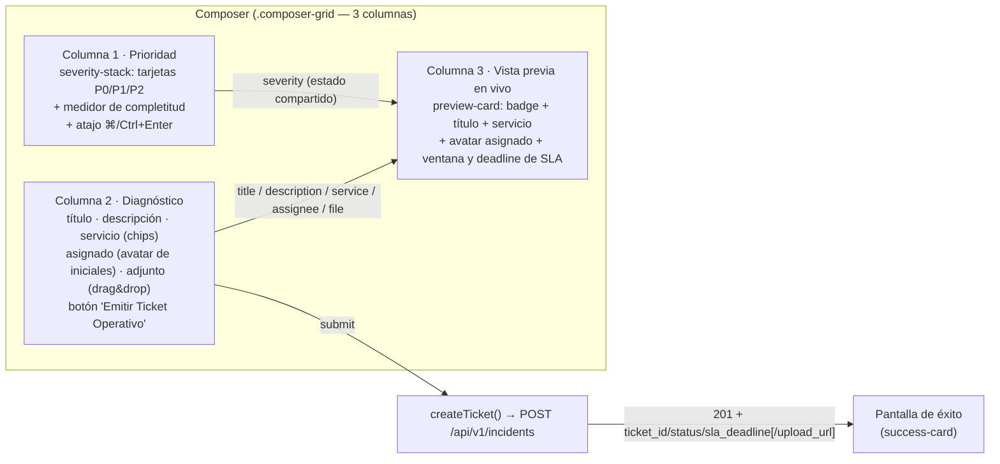
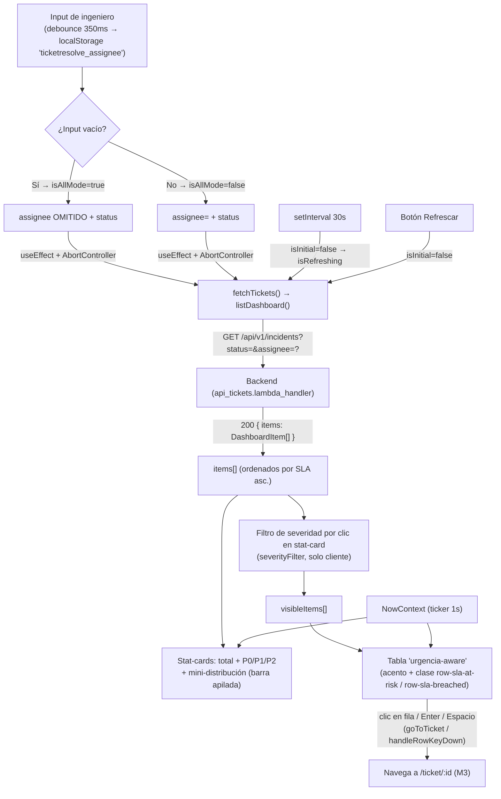
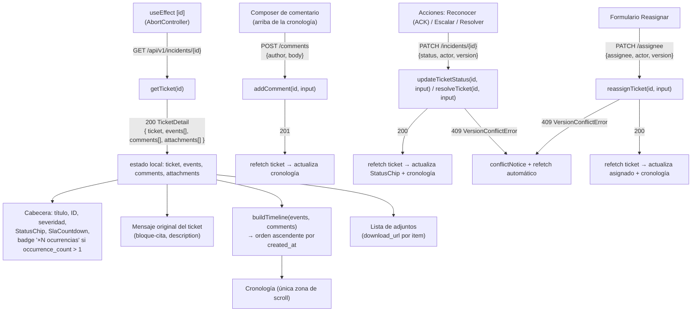

# TicketResolve — Frontend (React) y Dev Server · Estado actual y contrato

Complementa a [ARCHITECTURE.md](ARCHITECTURE.md) (backend). Este documento describe el **estado
real** del frontend React y del servidor de desarrollo local que conecta el front con los handlers
Python reales — no un plan o un mockup. Es la fuente de verdad para quien necesite trabajar en
el frontend o entender cómo se monta el flujo local de extremo a extremo.

> **Slice actual:** M1 (Ticket Composer — crear ticket) + M2 (Dashboard, vista global o por
> ingeniero) + M3 (Consola del ticket — cronología, comentarios, máquina de estados,
> reasignación, descarga de adjuntos).
> **Modo:** todo local — React (Vite) → dev server (FastAPI) → handlers Lambda Python → DynamoDB
> local (moto in-process, con seed demo de 7 tickets). **No se toca AWS ni infra.**
> **Contrato de datos:** espejo de [ARCHITECTURE.md §6](ARCHITECTURE.md); los tipos TypeScript en
> `src/types.ts` reflejan el contrato actual, incluido M3 (`TicketDetail`, `TicketEvent`,
> `TicketComment`, `TicketAttachment` con `download_url`).

---

## Qué cambió (2026-06-10)

Respecto a la versión previa de este documento (solo M1 + M2):

- **Nueva pantalla M3 — Consola del ticket** (`/ticket/:id`, `pages/TicketDetail.tsx`): cronología
  unificada de eventos + comentarios, composer de comentario, acciones **Reconocer (ACK)** /
  **Escalar** / **Resolver** (máquina de estados, con manejo de `409` por versión), formulario de
  **Reasignación**, badge **"×N ocurrencias"** para tickets deduplicados, y lista de adjuntos con
  enlace de **descarga** (`download_url`). Documentado en la nueva §5.
- **M2 Dashboard — vista "Todos los pendientes":** la barra de búsqueda puede dejarse vacía; en
  ese caso el dashboard ya no pide `assignee` y muestra **todos** los tickets del estado
  seleccionado (antes el dashboard exigía un ingeniero). Cada fila de la tabla ahora es **clicable**
  (y navegable con teclado) y enruta a M3.
- **`src/api/client.ts` ampliado:** nuevas funciones `getTicket`, `addComment`,
  `updateTicketStatus` (PATCH genérico de estado), `resolveTicket` (wrapper de
  `updateTicketStatus` a `RESOLVED`), `reassignTicket`, y la clase `VersionConflictError` para
  distinguir `409` de otros errores. `listDashboard` ahora omite el parámetro `assignee` cuando
  está vacío.
- **`src/types.ts` ampliado:** nuevos tipos `TicketMeta`, `TicketEvent`, `TicketComment`,
  `TicketAttachment`, `TicketDetail`, `AddCommentInput`, `ResolveTicketInput`/`Response`. `TicketMeta`
  incluye los campos opcionales `occurrence_count`, `source`, `dedup_hash` (este último presente en
  el tipo mas no usado en UI — el backend lo excluye de la respuesta real).
- **Dev server:** ahora siembra **7 tickets de demostración** al arrancar (ver
  [README.md](README.md)), por lo que M2/M3 tienen datos desde el primer render.
- **Tests:** 41 → **85** (suite nueva `TicketDetail.test.tsx` con 21 tests; `client.test.ts`
  creció de 9 a 28; `Dashboard.test.tsx` de 17 a 21 por la cobertura del modo "todos").

---

## 1. Arquitectura local de extremo a extremo

```
┌─────────────────────┐     HTTP/JSON      ┌──────────────────────────┐
│  React (Vite dev)   │  ──────────────►   │  Dev server (FastAPI)    │
│  localhost:5173     │   /api/v1/...      │  localhost:8000          │
│                     │  (proxy de Vite)   │                          │
└─────────────────────┘                    │  traduce HTTP → evento   │
                                           │  HTTP API v2 e invoca:   │
                                           │  api_tickets.lambda_handler
                                           │            │             │
                                           │            ▼             │
                                           │  moto in-process DynamoDB│
                                           │  + bucket S3 (mock)      │
                                           └──────────────────────────┘
```

- El dev server **reutiliza el mismo `lambda_handler`** que correrá en AWS. No reimplementa lógica:
  solo arma el `event` v2 y devuelve `{statusCode, headers, body}` como respuesta HTTP.
- DynamoDB y S3 son **moto in-process**: el server arranca un contexto `mock_aws` al inicio, crea la
  tabla (`PK/SK` + `GSI1` + `GSI2`, `PAY_PER_REQUEST`, TTL `ttl`) y el bucket, y los mantiene vivos
  mientras el proceso corre. Persiste en memoria durante la sesión (se reinicia al reiniciar el server).
  *(Cambiar a DynamoDB Local persistente = setear `endpoint_url` en `shared/ddb.py`; fuera de alcance ahora.)*

---

## 2. Dev server — `Dev/devserver/`

```
Dev/devserver/
  __init__.py
  main.py        # FastAPI app
```

**Stack:** FastAPI + uvicorn (en `requirements-dev.txt`). Python 3.12.

**Comportamiento de `main.py`:**
1. Al arrancar (`startup`): activa `mock_aws` (de `moto`), setea `os.environ["TABLE_NAME"]` y
   `os.environ["ATTACHMENTS_BUCKET"]`, crea la tabla y el bucket. Importa el handler **después** de
   activar moto y de setear el env (igual que en los tests) para que los clientes boto3 lazy queden
   interceptados.
2. **Ruta catch-all** para `GET|POST|PATCH|OPTIONS /api/v1/{path:path}`: construye un evento HTTP
   API v2 (`version:"2.0"`, `rawPath`, `requestContext.http.method`, `rawQueryString`,
   `queryStringParameters`, `headers`, `body`, `isBase64Encoded:false`), invoca
   `api_tickets.lambda_handler(event, None)`, y devuelve una `Response` de FastAPI con el
   `statusCode`, headers y body que retorne el handler.
3. **CORS** habilitado para `http://localhost:5173` (por si no se usa el proxy de Vite).
4. Endpoint de salud `GET /health` → `{"status":"ok"}`.
5. Arrancable con: `uvicorn devserver.main:app --reload --port 8000` desde `Dev/` (con el venv activo
   y `src/` en el path).

> El dev server NO duplica validaciones ni lógica de negocio: todo pasa por el handler real.

---

## 3. Frontend React — `Dev/frontend/`

### 3.1 Stack

| Aspecto | Decisión |
|---|---|
| Build / dev server | **Vite** |
| UI | **React 19 + TypeScript** |
| Routing | **React Router v7** — `/nuevo` (M1), `/dashboard` (M2) y `/ticket/:id` (M3), con redirect de `/` a `/nuevo` |
| Estado | Local con hooks (`useState`, `useEffect`, `useMemo`, `useCallback`, `useRef`). **Sin Redux ni librería de estado global.** Un único `Context` (`NowContext`) para el reloj global de SLA |
| HTTP | `fetch` encapsulado en `src/api/client.ts`, sin librería de HTTP externa |
| Estilos | **CSS plano** con tokens en `:root` (`src/styles.css`) — sistema de diseño "Nexus" (ver §3.2). No hay CSS Modules ni librería de componentes UI |
| Proxy de Vite | `vite.config.ts` proxea `/api` → `http://localhost:8000`. El front llama rutas relativas `/api/v1/...`; sin problemas de CORS en dev. Base configurable por `VITE_API_BASE` (default `""` → usa el proxy) |
| Testing | **Vitest + Testing Library + jsdom** (ver §8) |

### 3.2 Sistema de diseño "Nexus" (`src/styles.css`)

El frontend evolucionó de un CSS plano básico a un **sistema de diseño con tokens**, definido
íntegramente en `:root` dentro de `src/styles.css` (sección encabezada `Design System v4 "NEXUS"`).
El lenguaje visual es **futurista navy/teal profundo con glow cian eléctrico y glassmorphism**,
inspirado — según el comentario del propio archivo — en "consolas de operaciones de ciencia-ficción:
paneles de vidrio flotando sobre una red de constelaciones luminosas, con acentos cian que respiran
y laten".

**Familias de tokens definidas:**

| Familia | Tokens representativos | Uso |
|---|---|---|
| Fondo (escala navy/teal) | `--bg-base`, `--bg-surface`, `--bg-elevated`, `--bg-overlay`, `--bg-muted`, `--bg-subtle` | Capas de profundidad del lienzo |
| Superficies de vidrio | `--glass-bg`, `--glass-bg-strong`, `--glass-border`, `--glass-blur` | Paneles `backdrop-filter: blur(...)` (`.card`, `.composer-col`, `.dashboard-header`, `.stat-card`, `.table-panel`) |
| Bordes | `--border-subtle` … `--border-accent` | Contornos sutiles que "brillan" en los bordes |
| Texto | `--text-primary` … `--text-dim`, `--text-inverse` | Escala de blancos/teales fríos con contraste AA sobre navy profundo |
| Acento / aurora | `--accent`, `--accent-glow`, `--accent-hover`, `--gradient-aurora`, `--gradient-aurora-soft` | Trío cian/teal eléctrico (`#38e0e8` / `#2bd4b4` / `#1fb8c4`) usado en CTAs, líneas de acento, logo y glows |
| Severidad | `--sev-p0-*`, `--sev-p1-*`, `--sev-p2-*` | P0 = coral/rojo neón, P1 = ámbar, P2 = cian — con variantes `bg`/`border`/`text`/`dot`/`glow` |
| SLA | `--sla-ok`, `--sla-warn`, `--sla-danger` (+ `-glow`) | Estados de la cuenta regresiva (`SlaCountdown`) y filas "at-risk"/"breached" |
| Estado de ticket | `--status-open/ack/escalated/resolved`, `--chip-*-bg/color/border` | `StatusChip` |
| Tipografía | `--font-sans` = "Plus Jakarta Sans"/"Inter" (vía Google Fonts), `--font-display`, `--font-mono`, escala `--text-xs` … `--text-4xl` | Jerarquía tipográfica display + body + mono (datos de SLA, IDs) |
| Espaciado / radios / sombras / transiciones | `--space-*`, `--radius-*`, `--shadow-*` (incl. `--shadow-glow`, `--shadow-p0`), `--ease-*`, `--duration-*` | Sistema de layout y motion consistente |

**Motivo visual de fondo (capas globales sobre `body`):**
- `body::before` — un degradado radial "aurora" multicapa (navy → teal → cian) con animación
  `aurora-drift` (28 s, infinita, alterna) que simula movimiento atmosférico lento.
- `body::after` — un **motivo de constelación**: puntos radiales tenues + líneas diagonales
  repetidas (`repeating-linear-gradient`) que evocan una red de nodos luminosos sobre el fondo,
  con opacidad baja (`0.65`) para no competir con el contenido.
- La barra de navegación (`.nav`) y las tarjetas (`.card`, `.composer-col`, `.stat-card`,
  `.dashboard-header`) llevan una **línea de acento cian superior** (`::before` con
  `var(--gradient-aurora)` y `box-shadow` de glow) que las identifica como "paneles" del sistema
  Nexus, además de animaciones de pulso (`pulse-dot`, `aurora-flow`, `alert-pill-pulse`) en
  indicadores de estado vivo (punto de "Sistema operativo" en el nav, píldora de alerta de SLA
  vencido, footnote de la vista previa del composer).

**Convención de nombres de clases por dominio:** `composer-*` (M1), `dashboard-*`/`stat-*`/`table-*`
(M2), `sev-*`/`severity-badge-*` (severidad), `status-chip-*`/`status-segment-*` (estado),
`sla-countdown-*` (SLA), `btn-primary`/`btn-secondary`/`btn-ghost`/`btn-link` (acciones),
`msg-*`/`error-msg`/`info-msg` (feedback). El archivo conserva algunos **alias legacy**
(`.error-msg`, `.info-msg`, `.btn-link`, `.success-icon`) por compatibilidad con marcado anterior;
para código nuevo prefiere los tokens/clases `msg-*`, `btn-secondary` y `success-icon-wrap`.

### 3.3 Estructura de carpetas

```mermaid
graph TD
    A["Dev/frontend/"] --> B["package.json · vite.config.ts · tsconfig.json · index.html"]
    A --> C["src/"]
    C --> D["main.tsx — router + StrictMode + NowProvider"]
    C --> E["App.tsx — layout, nav (Nuevo Ticket / Dashboard), Outlet"]
    C --> F["types.ts — espejo del contrato (Severity, Status, Create*, DashboardItem, TicketDetail, ...)"]
    C --> G["styles.css — Design System 'Nexus' (tokens + componentes visuales)"]
    C --> H["api/"]
    H --> H1["client.ts — createTicket, listDashboard, getTicket, addComment,<br/>updateTicketStatus, resolveTicket, reassignTicket, VersionConflictError"]
    H --> H2["client.test.ts — 28 tests"]
    C --> I["pages/"]
    I --> I1["CreateTicket.tsx — M1 · ruta /nuevo"]
    I --> I2["CreateTicket.test.tsx — 15 tests"]
    I --> I3["Dashboard.tsx — M2 · ruta /dashboard"]
    I --> I4["Dashboard.test.tsx — 21 tests"]
    I --> I5["TicketDetail.tsx — M3 · ruta /ticket/:id"]
    I --> I6["TicketDetail.test.tsx — 21 tests"]
    C --> J["components/"]
    J --> J1["SeverityBadge.tsx"]
    J --> J2["StatusChip.tsx"]
    J --> J3["SlaCountdown.tsx"]
    J --> J4["Spinner.tsx"]
    C --> K["providers/NowProvider.tsx — ticker global de 1s (NowContext)"]
    C --> L["hooks/useNow.ts — useContext(NowContext)"]
    C --> M["test/setup.ts — configuración Vitest + jest-dom"]
    C --> N["assets/ — hero.png, react.svg, vite.svg"]
```



### 3.4 Tipos (`src/types.ts`) — espejo del contrato de [ARCHITECTURE.md §6](ARCHITECTURE.md)

```ts
type Severity = "P0" | "P1" | "P2";
type Status = "OPEN" | "ACK" | "ESCALATED" | "RESOLVED";

interface CreateTicketInput {
  title: string; service: string; description: string;
  severity?: Severity; assignee?: string;
  attachment?: { filename: string; content_type: string };
}
interface CreateTicketResponse { ticket_id: string; status: Status; sla_deadline: string; upload_url?: string; }
interface DashboardItem {
  ticket_id: string; severity: Severity; status: Status;
  title: string; service: string; assignee: string; sla_deadline: string;
}

// ── M3 — Ticket detail / console ──────────────────────────────────
interface TicketMeta {
  ticket_id: string; title: string; service: string; description: string;
  severity: Severity; status: Status; assignee: string; sla_deadline: string;
  created_at: string; updated_at: string; version: number; attachments_count: number;
  occurrence_count?: number; source?: string; dedup_hash?: string;
}
interface TicketEvent { event_type: string; actor?: string; action?: string; payload?: Record<string, unknown>; created_at: string; }
interface TicketComment { author: string; body: string; created_at: string; }
interface TicketAttachment { filename: string; content_type?: string; size?: number; created_at?: string; download_url?: string; }
interface TicketDetail { meta: TicketMeta; events: TicketEvent[]; comments: TicketComment[]; attachments: TicketAttachment[]; }

interface AddCommentInput { author: string; body: string; }
interface ResolveTicketInput { actor: string; version: number; }
interface ResolveTicketResponse { status: Status; version: number; }
```

Estos tipos son un espejo del contrato del backend (§6 de [ARCHITECTURE.md](ARCHITECTURE.md)).
Nota: `TicketMeta.dedup_hash` está tipado en el cliente, pero el backend **excluye** ese campo de
la respuesta real de `get_ticket` (`_strip_ddb_keys`) — el campo queda `undefined` en runtime y
no se usa en ninguna pantalla.

### 3.5 Capa de datos — `src/api/client.ts`

| Función | Firma | Comportamiento |
|---|---|---|
| `createTicket` | `(input: CreateTicketInput) => Promise<CreateTicketResponse>` | `POST ${BASE}/api/v1/incidents` con `Content-Type: application/json` |
| `listDashboard` | `(assignee: string, status: string, signal?: AbortSignal) => Promise<DashboardItem[]>` | `GET ${BASE}/api/v1/incidents?status=..[&assignee=..]`; **omite `assignee` si está vacío/whitespace** (vista "todos los pendientes" — ver [ARCHITECTURE.md §5, PA-2](ARCHITECTURE.md)). Devuelve `data.items`. Acepta un `AbortSignal` **opcional** para que el llamador cancele peticiones en vuelo cuando cambian los filtros (corrección de condición de carrera, ver §5.2) |
| `getTicket` | `(id: string, signal?: AbortSignal) => Promise<TicketDetail>` | `GET ${BASE}/api/v1/incidents/{id}` — payload completo de M3 (`meta`, `events[]`, `comments[]`, `attachments[]` con `download_url`) |
| `addComment` | `(id: string, input: AddCommentInput) => Promise<void>` | `POST ${BASE}/api/v1/incidents/{id}/comments`; el contrato solo garantiza `{ok:true}` en `201` — el llamador refetchea o anexa optimistamente |
| `updateTicketStatus` | `(id: string, input: {status, actor, version}, signal?) => Promise<ResolveTicketResponse>` | `PATCH ${BASE}/api/v1/incidents/{id}` — transición genérica de la máquina de estados (`ACK`/`ESCALATED`/`RESOLVED`). `409` ⇒ lanza `VersionConflictError`; `400` ⇒ `Error` genérico con el mensaje del servidor (transición inválida) |
| `resolveTicket` | `(id: string, input: ResolveTicketInput) => Promise<ResolveTicketResponse>` | Wrapper de compatibilidad: `updateTicketStatus(id, {status:"RESOLVED", ...})` |
| `reassignTicket` | `(id: string, input: {assignee, actor, version}, signal?) => Promise<{assignee, version}>` | `PATCH ${BASE}/api/v1/incidents/{id}/assignee`. `409` ⇒ `VersionConflictError`; `400` ⇒ `Error` genérico (ticket `RESOLVED` o campos faltantes) |
| `VersionConflictError` | `class extends Error` | `isVersionConflict = true`; lanzada por `updateTicketStatus`/`reassignTicket` en `409`. Los componentes hacen `instanceof`-check para mostrar un aviso "el ticket cambió, recargando…" en vez de un error genérico |
| `handleResponse<T>` (interno) | `(res: Response) => Promise<T>` | Si `!res.ok`, intenta leer `{error}`/`{message}` del JSON de error y lanza `Error(message)`; si falla el parseo, usa `HTTP <status>` |

`BASE = import.meta.env.VITE_API_BASE ?? ""`. En AWS, cambiar `VITE_API_BASE` a la URL de API
Gateway es el único ajuste necesario (CORS ya configurado como `*` en el diseño cloud).

---

## 4. M1 — "Ticket Composer" (`/nuevo`, `pages/CreateTicket.tsx`)

M1 dejó de ser un formulario vertical simple y es ahora un **espacio de trabajo a pantalla
completa de tres columnas**, sin scroll vertical en desktop (clase raíz `.composer`, que cancela
el padding de `.page-container` y fija `height: calc(100vh - 60px)`). El comentario del propio CSS
lo resume: *"Three working zones (severity / canvas / live preview) that share state in real
time… a console, not a form."* Por debajo de 1100px de ancho, el layout colapsa a una pila
desplazable (`grid-template-columns: 1fr`).



### 4.1 Funcionalidades implementadas

| Funcionalidad | Detalle |
|---|---|
| **Tarjetas de severidad seleccionables** | `role="radiogroup"`/`role="radio"`; tres tarjetas P0/P1/P2 con glifo, descripción corta y SLA (`15 min` / `4 h` / `24 h`); resaltado visual por severidad (`is-selected`, glow de color) |
| **Chips de servicio** | Lista fija `ERP, Pagos, Red, Impresoras, Correo`, cada uno con un ícono; selección única tipo radio (`service-chip is-selected`) |
| **Contadores de caracteres en vivo** | Título (`TITLE_LIMIT = 200`) y descripción (`DESCRIPTION_LIMIT = 4000`); cambian de color (`data-warn="true"`) al superar el 90% del límite |
| **Avatar de iniciales del asignado** | `initialsOf(name)` deriva 1–2 iniciales del nombre escrito; se muestra dentro del input (`assignee-preview-avatar`) y en la vista previa |
| **Zona de adjunto drag & drop** | `dropzone` con estados `is-dragging`/`has-file`; acepta clic (abre selector de archivo) o arrastrar-soltar; muestra nombre y tamaño en KB; hint "PNG, JPG, PDF, ZIP — hasta 10 MB" (validación de tipo/tamaño **no** implementada en cliente — ver §11) |
| **Medidor de completitud** | `composer-progress`: barra de 0–100% calculada sobre 5 señales (título, descripción, servicio, severidad, asignado **o** adjunto) — puramente informativo/cosmético |
| **Atajo de teclado** | `Cmd/Ctrl + Enter` dispara `formRef.current?.requestSubmit()` desde cualquier campo del formulario |
| **Vista previa en vivo** | Columna 3: tarjeta que refleja en tiempo real severidad (badge + color de borde/glow), `StatusChip status="OPEN"`, título, fragmento de descripción (máx. 140 caracteres), chips de servicio/asignado/adjunto, y **proyección de SLA calculada en cliente** (ver §4.2) |
| **Sin scroll en desktop** | `.composer` fija altura `calc(100vh - 60px)` (60px = altura del nav) con `min-height: 560px` / `max-height: 980px`; cada columna gestiona su propio overflow (`composer-col-main` permite scroll interno si el contenido crece) |

### 4.2 Proyección de SLA en cliente (vista previa)

La vista previa **no** consulta al backend para mostrar el deadline proyectado: lo calcula
localmente a partir de `new Date()` y la severidad seleccionada, usando las mismas ventanas que
documenta [ARCHITECTURE.md](ARCHITECTURE.md) (severidad → SLA):

| Severidad | Ventana SLA (cliente) | Constante `slaMinutes` |
|---|---|---|
| P0 | 15 minutos | `15` |
| P1 | 4 horas (240 min) | `240` |
| P2 | 24 horas (1440 min) | `1440` |

`slaProjection` (memoizado sobre `selectedSeverity`) produce `{ deadline, label, relative }`, donde
`label` es una fecha/hora formateada en `es-GT` y `relative` un texto tipo `"en 4 h"`. El
**footnote** de la columna 3 aclara explícitamente que es una proyección y que *"el SLA real
comienza a contar en el instante en que emites el ticket"* — el valor autoritativo sigue siendo
`sla_deadline` que devuelve el backend en `CreateTicketResponse`.

### 4.3 Flujo de envío y manejo de adjuntos

1. Validación cliente mínima: título y descripción no vacíos (mensajes en español, `role="alert"`).
2. `createTicket(input)` — `input.attachment` solo se incluye si el usuario seleccionó un archivo
   (`{filename, content_type}`).
3. Si la respuesta trae `upload_url` y hay archivo, el front intenta `PUT` el archivo a esa URL
   presigned **dentro de un `try/catch` que ignora silenciosamente cualquier error** (comentario en
   código: *"silently ignored — moto presigned PUT may fail"*). El ticket se considera creado
   igualmente y se muestra la pantalla de éxito.
4. Pantalla de éxito (`success-card`): ícono animado, `ticket_id`, `StatusChip` con el estado
   devuelto, fecha de `sla_deadline` formateada, nota de "URL presigned generada" si aplica, y dos
   acciones: "Emitir otro ticket" (resetea el formulario) o "Ver en Dashboard" (`Link` a `/dashboard`).

---

## 5. M2 — Dashboard (`/dashboard`, `pages/Dashboard.tsx`)

El Dashboard tiene **dos modos**, decididos por el contenido del campo de búsqueda:

- **"Todos los pendientes"** (`isAllMode = true`): el campo de ingeniero está **vacío**.
  `listDashboard` se llama **sin** el parámetro `assignee` y el backend responde con todos los
  tickets que coinciden con el `status` seleccionado, vía `Scan` paginado (ver
  [ARCHITECTURE.md §5, PA-2](ARCHITECTURE.md)). Es el modo por defecto al entrar sin valor
  guardado en `localStorage`.
- **"Por ingeniero"** (`isAllMode = false`): el campo de ingeniero tiene texto. `listDashboard` se
  llama **con** `assignee=<valor>` y el backend resuelve vía `Query` sobre GSI1
  (`ASSIGN#<eng>`), igual que en la versión anterior de este documento.

Ambos modos comparten el resto de la UI (stat-cards, filtro de severidad, tabla, polling). La única
diferencia visible adicional es el texto de cabecera/placeholder, que indica si se está viendo la
bandeja global o la de un ingeniero específico.



### 5.1 Funcionalidades implementadas

| Funcionalidad | Detalle |
|---|---|
| **Modo "Todos los pendientes" vs "Por ingeniero"** | Determinado por `isAllMode` (input de ingeniero vacío). En modo "todos los pendientes", `listDashboard` omite `assignee` y el backend hace `Scan` paginado sobre la tabla filtrando por `status` (ver [ARCHITECTURE.md §5, PA-2](ARCHITECTURE.md) para el trade-off de costo/latencia frente al `Query` por GSI1). El texto de cabecera/placeholder cambia según el modo |
| **Filas clicables hacia M3** | Cada fila de la tabla es navegable: clic, `Enter` o `Espacio` (`goToTicket` / `handleRowKeyDown`, `role="button"`/`tabIndex=0` en la fila) llevan a `/ticket/:id` (`pages/TicketDetail.tsx`, ver §6) |
| **Stat-cards con mini-distribución y filtro clicable** | 4 tarjetas: total + P0/P1/P2. La tarjeta "total" muestra una barra apilada (`stat-distribution`) con los porcentajes `dist.p0/p1/p2`. Las tarjetas de severidad son **botones** (`aria-pressed`, `disabled` si no hay datos) que alternan `severityFilter` — clic de nuevo quita el filtro. Filtrado **100% en cliente**, no reconsulta al backend |
| **Tabla "urgencia-aware"** | Cada fila recibe `rowUrgencyClass(item)`: acento por severidad (`row-p0/p1/p2`) más, si aplica, `row-sla-at-risk` (< 15 min restantes, `SLA_AT_RISK_MS`) o `row-sla-breached` (deadline ya pasado). Columnas: ID, Severidad (`SeverityBadge`), Estado (`StatusChip`), SLA restante (`SlaCountdown`), Título, Servicio, Asignado (avatar + nombre) |
| **Barra de búsqueda del ingeniero** | Input con avatar de iniciales (`assignee-preview-avatar`) y lupa SVG; valor **debounced 350 ms** antes de disparar fetch y persistir en `localStorage` (`ticketresolve_assignee`). Vaciar el campo y persistir esa selección activa el modo "todos los pendientes" en la próxima carga |
| **Control de estado segmentado** | `role="radiogroup"` con los 4 estados (`OPEN/ACK/ESCALATED/RESOLVED`) como segmentos clicables, default `OPEN` |
| **Píldora de "SLA vencido"** | `dashboard-alert-pill`, visible solo si `breachedCount > 0` (tickets cuyo `sla_deadline` ya pasó según `useNow()`); animación de pulso |
| **Polling cada 30 s + refresco manual** | `setInterval` de 30 s vía refs (`queryRef`/`statusRef`) que no reinician el intervalo en cada cambio de filtro; botón "↻ Refrescar" con `AbortController` propio. Ambos invocan `fetchTickets(..., isInitial=false, ...)` → `isRefreshing` (no vuelve a mostrar el esqueleto de carga) |
| **`isRefreshing` vs `isLoading`** | `isLoading` solo se activa en la carga inicial (tabla vacía → muestra `SkeletonTable`); `isRefreshing` cubre polling/filtros/refresco manual y se refleja como spinner discreto (`Spinner`) en la cabecera de la tabla y en "Actualizado: hh:mm:ss" |
| **Estados de UI completos** | sin ingeniero (modo "todos los pendientes" activo), cargando (esqueleto), error (`msg msg-error`), vacío (sin tickets para ese estado), vacío por filtro de severidad (con botón para limpiar el filtro), y tabla con datos |

### 5.2 Carrera de peticiones y cancelación (`AbortController`)

`fetchTickets` es una función consolidada que recibe un `AbortSignal`. Un único `useEffect`
(disparado por `[assigneeQuery, status]`) crea un `AbortController` por petición y lo cancela en su
`cleanup`, eliminando la condición de carrera que existiría con dos `useEffect` independientes
(comentario en código: *"Eliminates the double-fetch + race condition… (IMP-06)"*). `listDashboard`
propaga el `signal` hasta el `fetch`; si la petición fue abortada, la respuesta se ignora sin
marcarse como error. Este mismo patrón (`AbortController` por efecto) se reutiliza en M3
(`pages/TicketDetail.tsx`) para la carga del detalle del ticket.

---

## 6. M3 — Consola del ticket (`/ticket/:id`, `pages/TicketDetail.tsx`)

M3 es la pantalla de **detalle y operación** de un ticket individual. Es el destino de las filas
clicables del Dashboard (M2) y del `Link` "Ver en Dashboard" no aplica aquí — se llega únicamente
navegando desde M2 o introduciendo la URL `/ticket/:id` directamente.



### 6.1 Funcionalidades implementadas

| Funcionalidad | Detalle |
|---|---|
| **Carga del detalle** | `useEffect` con `AbortController` (mismo patrón IMP-06 que M2) llama `getTicket(id)` → `GET /api/v1/incidents/{id}` (ver [ARCHITECTURE.md §6](ARCHITECTURE.md)). Estados de UI: cargando, error (`msg msg-error`, incl. ticket no encontrado / 404), y vista cargada |
| **Cabecera del ticket** | Título, `ticket_id`, `SeverityBadge`, `StatusChip status={ticket.status}`, `SlaCountdown` con `sla_deadline`, asignado actual (avatar de iniciales + nombre), servicio. Si `occurrence_count > 1`, se muestra el badge **"×N ocurrencias"** (dedup, ver [ARCHITECTURE.md §4.7](ARCHITECTURE.md)) |
| **Mensaje original como bloque-cita** | La `description` del ticket se renderiza en un `<blockquote>` ("ticket-original-message" o equivalente), separado visualmente de los comentarios posteriores |
| **Composer de comentario (arriba)** | `<textarea>` + botón "Comentar"; valida que el texto no esté vacío; `addComment(id, {author, body})` → `POST /api/v1/incidents/{id}/comments`. Al recibir `201`, se refresca el detalle completo (refetch) para que el nuevo comentario aparezca en la cronología |
| **Cronología unificada (`buildTimeline`)** | Función que combina `events[]` (`TicketEvent`) y `comments[]` (`TicketComment`) en una única lista, **ordenada ascendentemente por `created_at`**. Es la **única zona de scroll** de la página (`timeline-scroll` o equivalente); se recalcula y vuelve a renderizar tras cada acción exitosa (comentario, cambio de estado, reasignación) |
| **Iconografía y etiquetas de eventos** | `eventLabel(event)` / `eventIcon(event)` traducen `event_type` (`CREATED`, `ACK`, `ESCALATED`, `RESOLVED`, `COMMENT_ADDED`, `ALERT_DUPLICATE`, `ASSIGNED`) a texto legible e ícono; cada item de la cronología muestra `actor`, `action`/etiqueta y `created_at` formateado (`formatDateTime`) |
| **Acciones de estado: Reconocer (ACK) / Escalar / Resolver** | Botones que invocan `updateTicketStatus(id, {status, actor, version})` (ACK/ESCALATED) o `resolveTicket(id, {actor, version})` (RESOLVED, internamente delega en `updateTicketStatus` con `status:"RESOLVED"`) → `PATCH /api/v1/incidents/{id}`. Los botones disponibles dependen del estado actual según `ALLOWED_TRANSITIONS` (ver [ARCHITECTURE.md §4.3](ARCHITECTURE.md)): p.ej. desde `OPEN` se ofrecen ACK/Escalar/Resolver; desde `RESOLVED` no se ofrece ninguna acción de transición (estado terminal) |
| **Manejo de conflicto de versión (409)** | Si el backend responde `409` (versión `version` desactualizada respecto al `version` enviado), `client.ts` lanza `VersionConflictError`. La UI captura este error, muestra un **aviso de conflicto** (`conflictNotice`, p.ej. "El ticket cambió mientras lo editabas, recargando…") y dispara automáticamente un **refetch** del detalle para traer el `version` actual — el usuario debe reintentar la acción tras ver el estado actualizado |
| **Reasignación (Reasignar)** | Formulario con input de texto para el nuevo `assignee`; invoca `reassignTicket(id, {assignee, actor, version})` → `PATCH /api/v1/incidents/{id}/assignee` (ver [ARCHITECTURE.md §4.9](ARCHITECTURE.md)). Mismo manejo de `409`/`VersionConflictError` que las acciones de estado. Al completarse, refetch del detalle (actualiza el avatar/nombre del asignado y agrega el evento `ASSIGNED` a la cronología) |
| **Badge "×N ocurrencias"** | Visible solo si `ticket.occurrence_count` (campo opcional de `TicketMeta`, ver §3.4) es mayor a 1. Refleja cuántas veces el webhook de alertas detectó la misma combinación `service`+`alert_type` (deduplicación, ver [ARCHITECTURE.md §4.7](ARCHITECTURE.md)) |
| **Lista de adjuntos con descarga** | Cada `TicketAttachment` se muestra con nombre de archivo (`extensionOf` para el ícono/glyph vía `attachmentGlyph`), tamaño formateado (`formatBytes`), y un enlace de descarga que apunta a `attachment.download_url` (URL presigned GET de 5 minutos generada por el backend, ver [ARCHITECTURE.md §4.8](ARCHITECTURE.md)). El campo interno `s3_key` **nunca** llega al cliente |
| **Sin acciones cuando `RESOLVED`** | Al ser `RESOLVED` un estado terminal (`ALLOWED_TRANSITIONS["RESOLVED"] = []`), la consola no ofrece botones de transición de estado; el formulario de reasignación tampoco está disponible (el backend rechaza `PATCH /assignee` sobre tickets resueltos, ver [ARCHITECTURE.md §4.9](ARCHITECTURE.md)) |

### 6.2 Helpers internos (no exportados)

`pages/TicketDetail.tsx` define varios helpers de presentación que viven junto a su única
consumidora (mismo patrón que M1/M2, ver §7): `initialsOf` (avatar de iniciales, reutilizado del
patrón de M1/M2), `formatDateTime` (formato `es-GT` para timestamps de la cronología),
`formatBytes` (tamaño legible de adjuntos), `extensionOf` y `attachmentGlyph` (ícono según tipo de
archivo), `eventLabel` y `eventIcon` (traducción de `event_type` a texto/ícono), `buildTimeline`
(merge + orden de `events`/`comments`), y dos sub-componentes locales `Avatar` y `TimelineItem`.

---

## 7. Componentes, providers y hooks — inventario

| Archivo | Rol |
|---|---|
| [components/SeverityBadge.tsx](frontend/src/components/SeverityBadge.tsx) | Insignia de severidad (`P0 · Crítico` / `P1 · Alto` / `P2 · Normal`) con punto de color; usada en M1 (preview), M2 (tabla, filtro activo) y M3 (cabecera del ticket) |
| [components/StatusChip.tsx](frontend/src/components/StatusChip.tsx) | Chip de estado (`OPEN/ACK/ESCALATED/RESOLVED`); clases `status-chip-*` — el sistema de diseño posee los colores, no el componente. Usado en M2 (tabla) y M3 (cabecera) |
| [components/SlaCountdown.tsx](frontend/src/components/SlaCountdown.tsx) | Cuenta regresiva en vivo desde `sla_deadline`; consume `useNow()` (sin `setInterval` propio); clases `sla-ok/warn/danger` según ventana restante (`< 15 min` ⇒ warn, `≤ 0` ⇒ danger/"vencido"). Usado en M2 (tabla) y M3 (cabecera) |
| [components/Spinner.tsx](frontend/src/components/Spinner.tsx) | Indicador de carga reutilizable, tamaño parametrizable (`size`); reemplaza spans inline repetidos en el Dashboard y en M3 |
| [providers/NowProvider.tsx](frontend/src/providers/NowProvider.tsx) | `NowContext` — expone el timestamp actual (ms) actualizado **una vez por segundo desde un único `setInterval` global**. Motivación documentada en código: evitar que cada `SlaCountdown` (potencialmente decenas de filas) registre su propio intervalo |
| [hooks/useNow.ts](frontend/src/hooks/useNow.ts) | `useNow(): number` — azúcar sintáctico sobre `useContext(NowContext)` |

Las tres páginas (`CreateTicket.tsx`, `Dashboard.tsx`, `TicketDetail.tsx`) definen además helpers
internos no exportados (`initialsOf`, `formatDeadline`/`formatRelative` en M1; `AssigneeAvatar`,
`SkeletonTable` en M2; el conjunto descrito en §6.2 para M3) que no constituyen componentes
reutilizables de primer nivel — viven junto a su única consumidora.

---

## 8. Pruebas del frontend (Vitest + Testing Library)

**Stack:** Vitest + `@testing-library/react` + `@testing-library/user-event` + `jest-dom` + `jsdom`,
configurado en [package.json](frontend/package.json) y [src/test/setup.ts](frontend/src/test/setup.ts).

**Scripts:**
```bash
npm test            # vitest run — corre toda la suite una vez
npm run test:watch  # vitest — modo watch
npm run test:coverage  # vitest run --coverage
```

**Inventario — 85 tests en 4 archivos:**

| Archivo | Tests | Cobertura funcional |
|---|---|---|
| [src/api/client.test.ts](frontend/src/api/client.test.ts) | 28 | `createTicket`, `listDashboard` (incl. omisión de `assignee` en modo "todos los pendientes"), `getTicket`, `addComment`, `resolveTicket`, `updateTicketStatus`, `reassignTicket`: respuesta exitosa, manejo de errores HTTP (`{error}`/`{message}`/fallback), `409` → `VersionConflictError`, parámetros de query, propagación de `AbortSignal` |
| [src/pages/CreateTicket.test.tsx](frontend/src/pages/CreateTicket.test.tsx) | 15 | Validación de campos requeridos, envío exitoso y pantalla de éxito, reseteo del formulario, estado de error de API (y reactivación del botón), flujo de adjunto (metadata enviada, nombre mostrado en dropzone), controles interactivos del composer (selección de severidad por defecto P2, actualización de la vista previa en vivo al cambiar severidad/servicio/título/asignado) |
| [src/pages/Dashboard.test.tsx](frontend/src/pages/Dashboard.test.tsx) | 21 | Estado sin asignado / modo "todos los pendientes", stat-cards en cero y con datos, render de filas/badges/chips, navegación de fila a M3 (clic/teclado), estado de carga (esqueleto), estado de error, resultados vacíos, persistencia en `localStorage` (lectura inicial y escritura tras debounce), `isRefreshing` vs `isLoading` (filas visibles durante refresco, sin esqueleto), `SlaCountdown` por fila (incl. marca "vencido"), píldora de alerta por SLA vencido, filtro de severidad vía stat-card (aplicar/quitar, estado vacío inline cuando el filtro no produce resultados) |
| [src/pages/TicketDetail.test.tsx](frontend/src/pages/TicketDetail.test.tsx) | 21 | Carga del detalle (éxito, error, ticket no encontrado), render de cabecera (severidad, estado, SLA, badge "×N ocurrencias"), bloque-cita del mensaje original, cronología unificada (`buildTimeline`: orden, eventos + comentarios), composer de comentario (envío, validación, refetch), acciones ACK/Escalar/Resolver (éxito + refetch, `409`/`VersionConflictError` → aviso de conflicto + refetch automático), formulario de reasignación (éxito + refetch, `409`), lista de adjuntos con enlaces de descarga (`download_url`) |

> El job `frontend` del CI ([.github/workflows/dev-ci.yml](../.github/workflows/dev-ci.yml)) corre
> `npm ci → npm run build → npm test`. No hay actualmente un umbral de cobertura mínima exigido para
> el frontend (a diferencia del backend, que exige ≥ 80% de líneas en `src/`) — **pendiente de
> decisión** si se quiere alinear ambos lados.

---

## 9. Cómo se corre todo

1. Backend/dev server: desde `Dev/` con el venv activo → `uvicorn devserver.main:app --reload --port 8000`
   (con `SEED_DEMO=1`, valor por defecto, se siembran 7 tickets de demostración al arrancar — ver
   [README.md](README.md)).
2. Frontend: desde `Dev/frontend/` → `npm install` → `npm run dev` (Vite en `:5173`, proxy a `:8000`).
3. Abrir `http://localhost:5173`: ver los tickets sembrados en M2 (modo "todos los pendientes" con
   el campo de ingeniero vacío, o filtrando por `ana`/`carlos`/`maria`), hacer clic en una fila para
   abrir su consola en M3, o crear un ticket nuevo en M1 y verlo aparecer en M2.

(El detalle paso a paso, con verificación de `/health` y la nota sobre adjuntos en modo moto, está
en [README.md](README.md).)

---

## 10. Qué NO cambia

- El backend Python (`src/`) y sus tests **no se tocan**. El dev server los consume tal cual.
- La infraestructura Terraform **no se toca**. Cuando se despliegue a AWS, el front solo cambia
  `VITE_API_BASE` a la URL de API Gateway (que ya tiene CORS `*`). Las 7 rutas del contrato HTTP
  (§6 de [ARCHITECTURE.md](ARCHITECTURE.md)) ya están implementadas en el backend Lambda; su
  cableado completo en API Gateway sigue siendo tarea de IaC — en local el dev server ya las sirve
  todas.
- El contrato HTTP (§6 de [ARCHITECTURE.md](ARCHITECTURE.md)) y los tipos en `src/types.ts` no
  cambiaron como resultado de esta actualización de documentación — los tipos del frontend
  (`src/types.ts`) se ampliaron para **reflejar** el contrato ya existente del backend (M3), no al
  revés.

---

## 11. Vacíos y supuestos detectados (para revisar con otros agentes/equipo)

- **Validación de adjuntos en cliente:** la zona de drag & drop comunica un límite ("PNG, JPG, PDF,
  ZIP — hasta 10 MB") pero el código **no valida tipo ni tamaño** antes de enviar la metadata al
  backend. El backend (`src/shared/s3.py`) sí valida `content_type` contra una lista permitida
  (`ALLOWED_CONTENT_TYPES`) y sanitiza el nombre de archivo (ver
  [ARCHITECTURE.md §4.8](ARCHITECTURE.md)), pero el límite de tamaño ("10 MB") mostrado en la UI no
  se verificó contra una validación equivalente en backend — confirmar con `arquitecto-backend` si
  existe o si debe agregarse (cliente, servidor o ambos).
- **Umbral de cobertura del frontend:** el CI exige ≥ 80% de líneas en el backend pero no define un
  umbral para el frontend. Señalado para que `devops-infra`/`qa-testing` decidan si conviene
  alinearlo.
- **Accesibilidad del motivo de fondo animado:** las animaciones `aurora-drift`/`aurora-flow`/
  `pulse-dot` corren de forma continua y no respetan `prefers-reduced-motion`. No se verificó si
  esto es un requisito del curso; se señala como posible mejora de accesibilidad a validar con
  `disenador-premium`/`security-auditor` (impacto en usuarios con sensibilidad al movimiento).
- **`VITE_API_BASE` en despliegue real:** este documento reitera (igual que la versión anterior)
  que el único cambio para apuntar a AWS es esa variable; no se encontró evidencia en el repo de
  que ese cableado ya se haya probado contra una API Gateway real — confirmar con `devops-infra`
  cuando exista ese entorno.
- **Sin enlace directo a M3 desde la navegación principal:** `App.tsx` no tiene un link de nav
  hacia `/ticket/:id`; M3 solo es alcanzable desde las filas del Dashboard (M2) o por URL directa.
  No se identificó si esto es una omisión o una decisión deliberada (p.ej. evitar exponer IDs sin
  contexto) — señalar a `disenador-premium` si se considera necesario un punto de entrada
  adicional (p.ej. buscador de ticket por ID).
