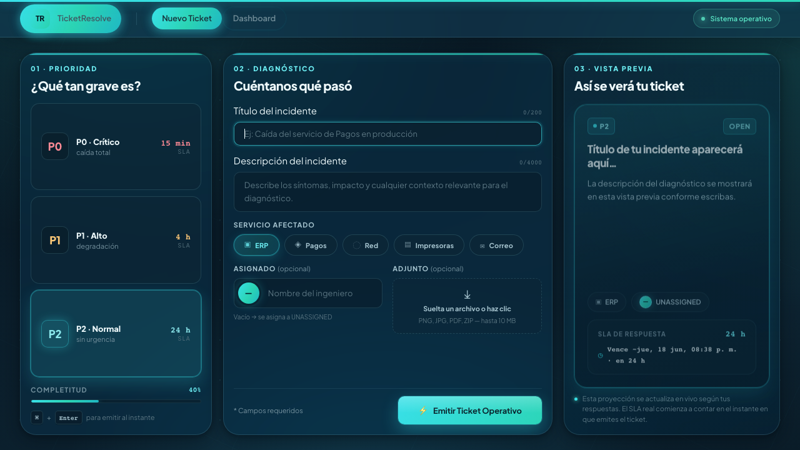
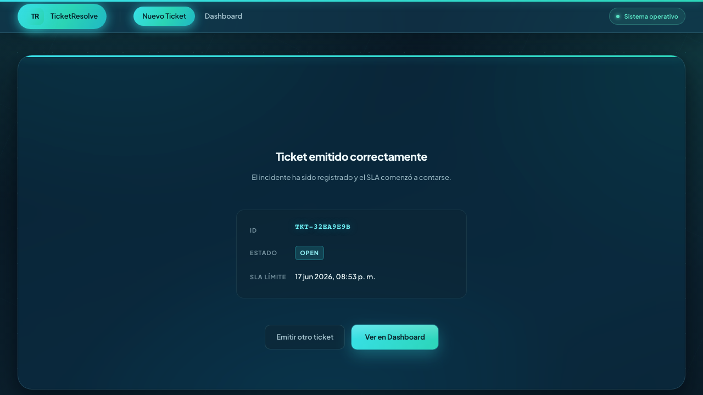

# Evidencia — Pruebas Automáticas de UI (Playwright)

Capturas de pantalla tomadas automáticamente **al final de cada escenario**
durante una corrida real de la suite. Todas las pruebas pasaron:

```
10 passed
```

| Imagen | Escenario | Estado capturado |
|--------|-----------|------------------|
|  `escenario-01.png` | 1 · Navegación | Compositor de Nuevo Ticket tras navegar por la barra. |
|  `escenario-02.png` | 2 · Crear ticket (happy path) | Pantalla "Ticket emitido correctamente" con ID, OPEN y SLA. |
| `escenario-03.png` | 3 · Validaciones | Formulario tras superar la validación de campos requeridos. |
| `escenario-04.png` | 4 · Vista previa + SLA | Vista previa en vivo con severidad P0 y completitud 100%. |
| `escenario-05.png` | 5 · Dashboard carga | Dashboard con tickets sembrados y tarjetas de resumen. |
| `escenario-06.png` | 6 · Filtro severidad | Tabla restaurada tras filtrar por P1. |
| `escenario-07.png` | 7 · Filtro estado | Tabla filtrada por estado (segmentado). |
| `escenario-08.png` | 8 · Filtro ingeniero | Estado vacío para un ingeniero inexistente. |
| `escenario-09.png` | 9 · Detalle ticket | Consola del ticket: cabecera, cronología y acciones. |
| `escenario-10.png` | 10 · Flujo completo | Ticket RESOLVED, SLA congelado y comentario publicado. |

## Cómo regenerar esta evidencia

Desde `Dev/frontend/`:

```bash
npx playwright test --config=playwright.evidence.config.ts
```

Luego se recopilan las imágenes de `test-results/**/test-finished-1.png`
hacia esta carpeta (una por escenario).
